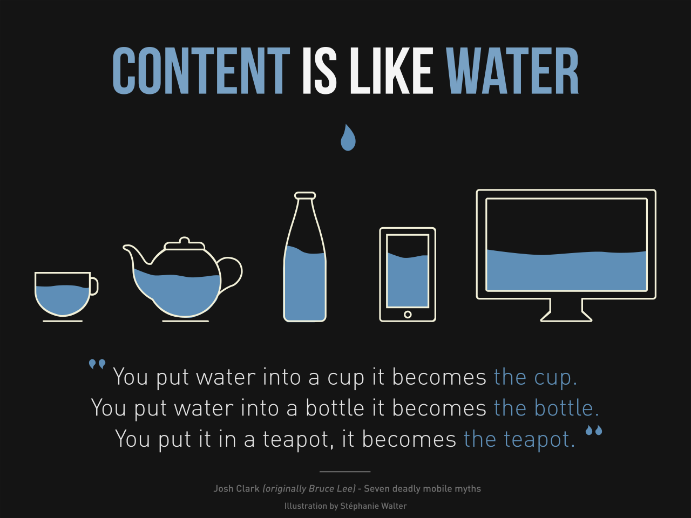
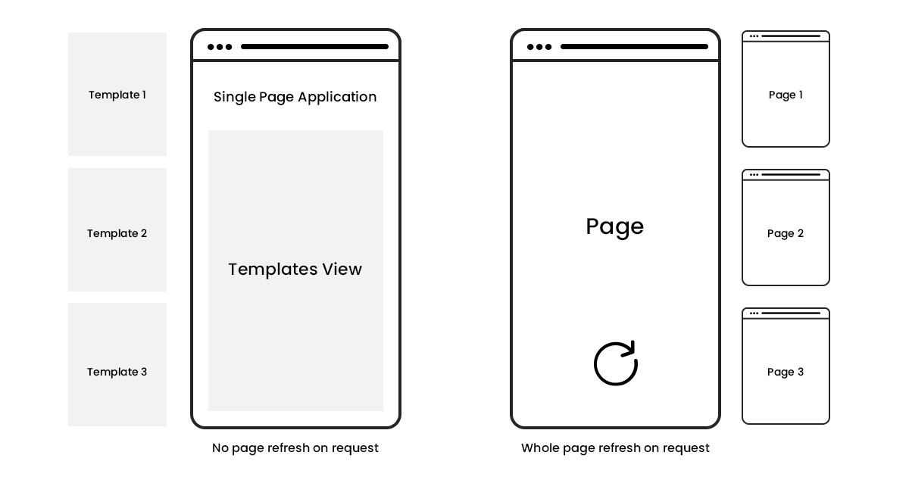

# Concetti e tecnologie preliminari

## Concetti preliminari

Di seguito si introducono alcuni concetti per permettere al lettore di acquisire le nozioni e definizioni necessarie alla corretta fruizione dell'elaborato nel suo complesso.

### Framework

Un framework (in italiano "quadro strutturale") nel campo dello sviluppo software rappresenta un'architettura logica sulla quale può essere progettato e realizzato un software.

Si compone di una pluralità di classi di base correlate tra loro, ciascuna delle quali contiene al proprio interno dei metodi che descrivono le proprietà e il comportamento di un elemento di riferimento.

Si differenziano dalle normali librerie in quanto sono definite dal cosiddetto principio dell'**Inversione del Controllo** (in inglese, Inversion of Control). Infatti utilizzando una libreria, è il codice a definire il "flow of control" richiamando elementi della libreria per svolgere determinati compiti, mentre con un Framework, è quest'ultimo a ricevere il controllo: il codice deve seguire un pattern ben definito.

Altre caratteristiche chiave di un Framework sono: 

- **Estensibilità**: l'utente può estendere il Framework per fornire nuove funzionalità specifiche
- **Non modificabilità**: il codice interno del Framework non è fatto per essere modificato.

Esiste una vasta gamma di diversi Frameworks, ognuno di questi costruiti su un linguaggio di programmazione e specializzati per svolgere funzioni differenti, nel campo dello sviluppo di Mobile Apps (React Native, utilizzato per esempio da Facebook e Tesla), del Data Science con TensorFlow o nel campo dello sviluppo web sia per lavorare nel Front-End (per esempio Angular, React o Vue) che nel Back-End (Ruby on Rails o Django).

### Responsive Web Design

Nei primi anni del 2010, gli sviluppatori e i designer di siti web dovettero affrontare un fenomeno storico. Sempre più utenti iniziavano a visualizzare e accedere al materiale web attraverso dispositivi mobili invece che dal tradizione desktop di casa. Furono allora ideate due soluzioni: adottare un Adaptive Design, per cui è necessario costruire diverse versioni di un design e a seconda delle dimensioni del dispositivo utilizzare la versione più adatta; oppure adottare un Responsive Design, lavorando su un unico design flessibile, che possa "rispondere" alla dimensione variabile del contenitore.

Il Responsive web design (RWD) è quindi un approccio allo sviluppo web che ha come fine ultimo quello di causare cambiamenti dinamici all'aspetto del sito web, a seconda della dimensione dello schermo o all'orientazione del dispositivo su cui il contenuto è visualizzato.

Il Responsive Desgin si fonda su tre principi chiave:

- **Fluid Grid System** (Griglia a proporzioni fluide) - I vari elementi occupando sempre la stessa percentuale di spazio nella finestra, ciò si ottiene mediante l'utilizzo delle cosiddette "unità relative", come percentuali o "em", invece che tramite unità assolute come pixel o points.
- **Fluid Image Use** (Immagini flessibili) - A differenza del testo, le immagini non possono "andare a capo" permettendo al contenuto di adattarsi al contenitore, appunto come un fluido. L'immagine apparirà sempre con le stesse dimensioni, causando problemi su dispositivi di dimensioni diverse. E' allora importante applicare la regola CSS —: img {max-width: 100%;}— per far sì che l'immagine si rimpicciolisca o si ingrandisca per adattarsi ai bordi.
- **Media Queries** - Questi sono gli strumenti usati per rilevare il tipo di dispositivo utilizzato e le dimensioni della finestra del browser per adattare il contenuto di conseguenza. Di fatto rappresenta un'espressione logica booleana: se la condizione (o le condizioni, utilizzando l'operatore AND) viene rispettata, allora vengono applicate tutte le regole CSS aggiuntive indicate al suo interno.

Esiste una serie di accortezze e "best pratcice" per implementare correttamente un Responsive Web Design: oltre a quello di utilizzare griglie e immagini flessibili è consigliato utilizzare solo immagini in formato Scalable Vector Graphics (SVGs), includere almeno tre breakpoints (condizioni per cui si attivano le media queries) e puntare ad un design minimale.

I vantaggi derivanti dall'utilizzo di un RWD sono numerosi: oltre a migliorare sensibilmente l'esperienza utente, lo stesso file HTML è utilizzato per tutti i tipi di dispositivo, con CSS che adatta il contenuto alla dimensione della pagina. L'alternativa infatti sarebbe quella di costruire una versione del sito per ogni tipologia di dispositivo (desktop, laptop, tablet e smartphones), opzione decisamente più costosa e time-consuming.

> “Web design is responsive design. Responsive web design is web design, done right.”
>
> — Andy Clarke, creative director, product & website designer

### Single Page Application e Client-Side Routing

Una Single Page Application (SPA) è un'applicazione web o un sito web che interagisce con l'utente riscrivendo in maniera dinamica il contenuto della pagina web. In una SPA infatti non avviene mai l'aggiornamento della pagina, ma tutto il codice HTML, CSS e Javascript necessario è caricato alla prima apertura del sito web.

Alcuni dei vantaggi di una SPA sono:

- E' veloce, dato che la maggior parte delle risorse (HTML + CSS + JS) sono caricati solo una volta durante il lifespan dell'applicazione. Solo il puro contenuto è trasmesso quando si cambia pagina.
- Può funzionare anche offline, se tutto il contenuto viene spedito nell'unica prima richiesta.

Ovviamente ci sono anche dei contro, tra cui la necessità che Javascript sia presente nel browser e abilitato dall'utente e un primo caricamento più lento.

Esistono due strade opposte per implementare una SPA: lavorando lato server (Server-Side Rendering) oppure lato client (Client-Side Routing).

Nel caso del SSR, il browser web invia una richiesta al server, che risponde inviando al client la pagina richiesta.

Il **Client-Side Routing** consiste invece in un meccanismo in cui l'utente naviga nel sito, e quando clicca su un'anchor tag (o link), invece che cambiare URL e quindi caricare una nuova pagina, l'URL viene modificato manualmente da Javascript - attraverso l'uso della funzione history.pushState - e di seguito il contenuto viene aggiornato in base alla pagina richiesta, cioè analizzando l'URL attuale.

## Tecnologie preliminari

Sono introdotte di seguito le nozioni generali sulle tecnologie a cui si farà riferimento durante il corso della trattazione.

### Markdown

Markdown è un linguaggio lightweight di markup con una semplice sinstassi del testo, viene utilizzato per creare testo formattato con l'ausilio di un comune editor di testo.

Creato da John Gruber nel 2004, e adesso è uno dei linguaggi di markup più usati al mondo.

Come afferma l'autore stesso, l'obiettivo principale di Markdown è quello di scrivere testo leggibile "così com'è", senza che sembri marcato con tags o istruzioni di formattazione, diversamente dal testo formattato con un linguaggio di markup come Rich Text Format (RTF) o HTML, che mostrano chiaramente istruzioni di formattazione.

Siti come GitHub, Reddit, Diaspora, Stack Exchange, OpenStreetMap, e SourceForge usano varianti di Markdown per facilitare le discussioni fra gli utenti e uniformare l'aspetto di queste.

### HTML, CSS, Javascript

Questi tre strumenti rappresentano la base per lo sviluppo web, in quanto ognuno di questi adempie ad un compito specifico e insieme si completano.

**HTML**, o **HyperText Markup Language**, è un linguaggio di markup.

La funzione principale di HTML è quella di descrivere la struttura e la formattazione di pagine web, fornendo la possibilità all'autore di:

- Pubblicare online documenti con testi, tabelle, liste, foto, ecc...
- Collegare tra loro diverse pagine web, attraverso l'uso di _collegamenti ipertestuali_ (hypertext links)
- Progettare moduli per condurre transazioni, per ricercare informazioni, per ordinare prodotti, ecc...
- Includere spread-sheets, video, audio e altre applicazioni direttamente nel documento

Attualmente i documenti HTML sono in grado di incorporare molte tecnologie, che offrono la possibilità di aggiungere al documento ipertestuale controlli più sofisticati sulla resa grafica, interazioni dinamiche con l'utente, animazioni interattive e contenuti multimediali. Si tratta di linguaggi come CSS, JavaScript, XML, JSON, o di altre applicazioni multimediali di animazione vettoriale o di streaming audio o video.

**Cascading Style Sheets**, noto come **CSS**, è un linguaggio usato per definire la formattazione di documenti HTML, ad esempio siti web e relative pagine web.

Il vantaggio principale offerto dall'utilizzo di CSS è la possibilità di separare i contenuti delle pagine HTML dalla loro formattazione o layout, permettendo una programmazione più chiara e facile da utilizzare e interpretare, garantendo di conseguenza anche il riutilizzo del codice ed una sua più facile manutenzione.

Le più importanti possibilità offerte da CSS3 sono:

- la possibilità di utilizzare codice CSS al posto delle immagini (jpg, png...) per creare trasparenze, bordi arrotondati e ombreggiature
- la possibilità di creare animazioni, trasformazioni e scalature come era possibile fare con Adobe Flash
- nuovi selettori e classi
- la possibilità di adattare il layout delle pagine web a vari dispositivi e media non più utilizzando più fogli di stile per ogni dispositivo ma uno solo che adatta la pagina a tutti.

**JavaScript** è un linguaggio di programmazione event-oriented, comunemente utilizzato nella programmazione Web lato client (esteso poi anche al lato server) per la creazione, in siti e applicazioni web, di effetti dinamici interattivi tramite funzioni e script invocate da eventi innescati dall'utente sulla pagina web in uso.

Le funzioni di script possono essere inserite nei file HTML o in appositi file separati con estensione .js e poi richiamati nel file HTML.

Le caratteristiche principali di JavaScript sono:

- Il codice non viene compilato, ma eseguito direttamente dal browser (lato client)
- La sinstassi è molto simile a quella di Java
- E' un linguaggio debolmente tipizzato

### Zero-MD, PrismJS e Boxicons

[Zero-MD] è un progetto open-source reso disponibile su Github da [Jason Lee]. E' un web component che permette di caricare un file Markdown esterno all'interno di un file HTML attraverso l'uso del tag `<zero-md>`.

A sua volta utilizza [Marked], un parser estremamente veloce e leggero per tradurre dal linguaggio Markdown a sintassi HTML.

[PrismJS] è invece un "synstax highlighter" lightweight, il suo compito è cioè quello di evidenziare in maniera intelligente porzioni di codice presenti nel documento HTML, colorando termini chiave a seconda del linguaggio di programmazione rilevato.

Infine [Boxicons] è una raccolta di icone web-friendly, quindi con lo specifico scopo di essere utilizzate nella costruzione di siti web, permettendo di inserire qualsiasi delle 1500+ icone attualmente presenti all'interno del documento in maniera semplice e intuitiva, evitando di ricorrere a immagini.

[zero-md]:<https://github.com/zerodevx/zero-md>
[jason lee]:<https://github.com/zerodevx>
[marked]:<https://github.com/markedjs/marked>
[prismjs]:<https://prismjs.com/>
[boxicons]:<https://github.com/atisawd/boxicons>