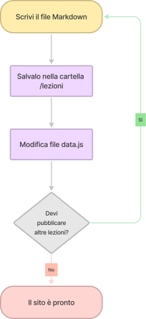
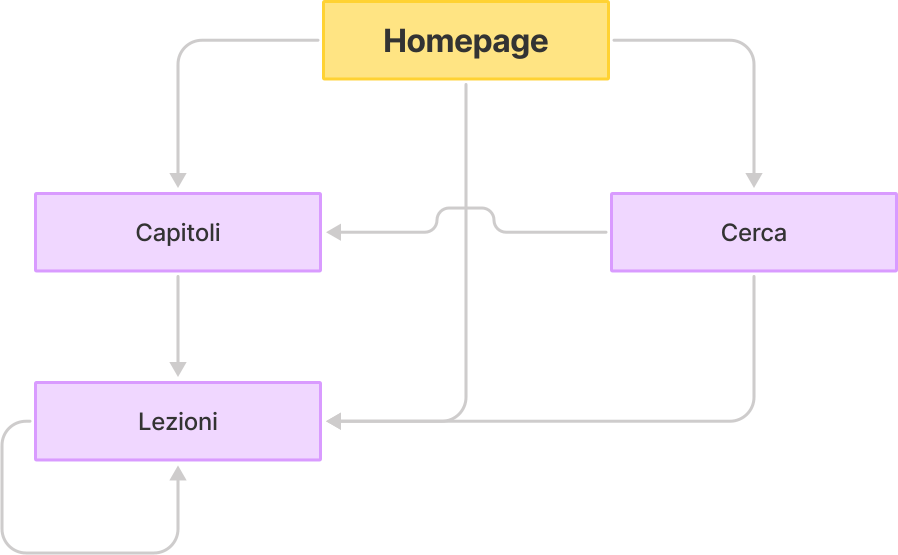

# Dimostrazioni d'uso per il fine proposto

In questo capitolo verranno illustrati due diversi casi e dimostrazioni d'uso del Framework MATOW: in primo luogo vedremo come un creatore di contenuti può utilizzare il Framework per generare un sito web statico e responsive, successivamente vedremo invece come l'utente e utilizzatore finale può navigare all'interno del sito e consultarne il contenuto.

## Creatore di contenuti

Immaginiamo che un professore abbia intenzione di trasferire del materiale didattico che utilizza a lezione (ad esempio slides o semplici appunti) in un sito web, in modo da renderli facilmente consultabili dagli studenti in qualsiasi momento e su qualsiasi dispositivo, decide allora di utilizzare MATOW per avere una struttura già ben definita.

Ipotizziamo che il professore voglia rendere disponibili 2 argomenti distinti (che chiameremo capitoli), ognuno composto da 5 lezioni, per un totale quindi di 10 lezioni.

Il prossimo passo è quindi quello di scrivere in Markdown i dieci file, rinominarli con nomi distinti (ad esempio "lezione-1.md", "lezione-2.md", etc.) e di spostarli quindi nella cartella "lezioni".

Ora non rimanche che organizzarli nel file data.js: andrà allora ad aggiungere le seguenti righe al file, inserendo nel campo "path" il nome del file Markdown al quale quella lezione fa riferimento.

```js
let chapters = [
    { "name":"Capitolo 1", "path":"capitolo-1", "lessons":[
        {"name":"Lezione 1.1", "path":"lezione-1"},
        {"name":"Lezione 1.2", "path":"lezione-2"},
        {"name":"Lezione 1.3", "path":"lezione-3"},
        {"name":"Lezione 1.4", "path":"lezione-4"},
        {"name":"Lezione 1.5", "path":"lezione-5"}
    ]},
    { "name":"Capitolo 2", "path":"capitolo-2", "lessons":[
        {"name":"Lezione 2.1", "path":"lezione-6"},
        {"name":"Lezione 2.2", "path":"lezione-7"},
        {"name":"Lezione 2.3", "path":"lezione-8"},
        {"name":"Lezione 2.4", "path":"lezione-9"},
        {"name":"Lezione 2.5", "path":"lezione-10"}
    ]}
];
```

A questo punto il sito web è pronto ad essere avviato e pubblicato.

Immaginiamo però che ora il professore voglia aggiungere una nuova lezione "lezione-extra.md" tra la lezione 2 e la lezione 3 del capitolo 1, allora non sarà necessario altro che spostare il file "lezione-extra.md" nella cartella lezioni e modificare il file data.js nel modo seguente:

```js
let chapters = [
    { "name":"Capitolo 1", "path":"capitolo-1", "lessons":[
        ...
        {"name":"Lezione 1.2", "path":"lezione-2"},
        {"name":"Lezione Extra", "path":"lezione-extra"},
        {"name":"Lezione 1.3", "path":"lezione-3"},
        ...
    ]},
    ...
];
```

Il Workflow finale per l'utilizzo del framework è allora rappresentato in figura.



## Utente finale

Ipotizziamo ora che uno degli studenti del professore, appena tornato a casa, voglia studiare gli argomenti caricati: aperto il sito web sul desktop si troverà davanti la pagina principale - o homepage - del sito, dove è visibile un indice di tutte le lezioni presenti.

Allora cliccherà sul link al Capitolo 1, da qui in poi gli basterà andare alla lezione successiva cliccando sul pulsante "Lezione successiva".

Immaginiamo però che lo studente abbia appena finito di studiare la lezione 4 ma per qualsiasi motivo debba lasciare la postazione al computer desktop: allora aprirà il sito dal cellulare e sempre attraverso l'indice nella homepage, si potrà recare alla lezione 5 cliccando direttamente sul link, per continuare lo studio.

In qualsiasi momento può anche utilizzare la barra di ricerca per ritrovare velocemente una lezione d'interesse, può anche personalizzare l'esperienza modificando a suo piacimento il tema o chiudendo/aprendo la barra di navigazione laterale.

Il sitemap è allora visualizzabile di seguito.


