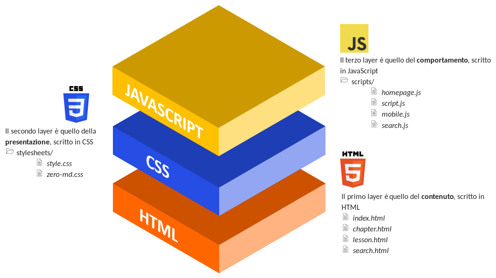
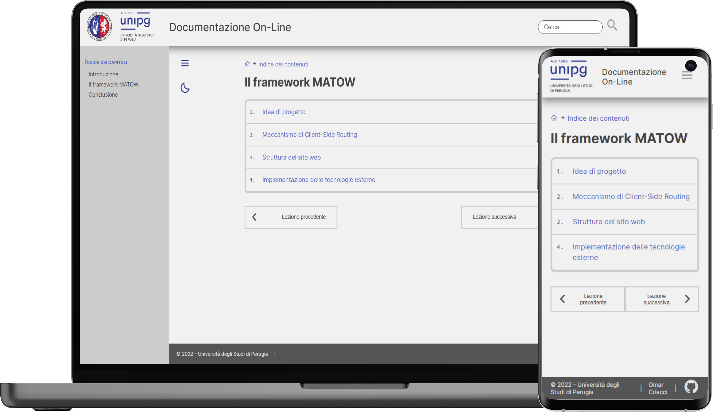

# Il Framework MATOW

In questo capitolo si descriverà in dettaglio la struttura e il funzionamento del **Framework MATOW - *MArkdown TO Web*** -, il progetto che rappresenta il nucleo di questo lavoro di tesi.

Quindi sarà illustrato il meccanismo implementato per sviluppare una Single Page Application (SPA), la struttura software sviluppata, in particolare con riferimento all’interfaccia grafica realizzata anallizando il codice HTML e CSS, e il suo funzionamento analizzando il codice Javascript. Si vedrà anche come è stato progettato il meccanismo di organizzazione delle varie lezioni e capitoli e infine come sono state implementate le varie tecnologie preesistenti nel progetto MATOW.

## Meccanismo di routing lato Client

Il routing lato Client - o client-side routing - permette di caricare e successivamente mostrare a schermo contenuto basandosi sull'URL del browser. 

Se non si fosse scelta questa soluzione sarebbe venuto meno uno dei principali obiettivi che il progetto di tesi si pone, cioè quello di rendere più semplice e accessibile la pubblicazione di informazioni: infatti si sarebbe reso necessario - oltre a scrivere il testo del contenuto in Markdown - anche scrivere un nuovo file HTML atto a contenere il testo.

Ogni volta che l'utente richiede di visualizzare una lezione particolare (ciò può avvenire attraverso il click sul collegamento alla lezione nella homepage o nella pagina del capitolo) viene reindirizzato alla pagina `www.example.com/lesson.html?r=nome-lezione` (r sta per request, richiesta).

Javascript allora attraverso la funzione `getLessonReq()` analizza l'URL attuale del browser, ricava la lezione desiderata e la inserisce nell' attributo src del tag `<zero-md>`, che provvederà a caricare il contenuto del file Markdown indicato, sempre all'interno dell'unico file lesson.html fornito.

```js
function getLessonReq() {
  // URL: www.example.com/lesson?r=lezione-esempio
  let str = window.location.search.substring(3);
  // str: lezione-esempio
  return decodeURI(str);
}
```

Nel momento invece in cui si passa da una lezione all'altra è fondamentale che la pagina non subisca un aggiornamento totale: allora ciò che succede è che Javascript modifica manualmente l'URL attraverso la funzione `history.pushState(null, null, lezione-successiva)` e in seguito attraverso la funzione `getLessonReq()` aggiorni il solo contenuto della pagina, modificando l'attributo `src` del tag `<zero-md>`.

Un meccanismo del tutto simile viene applicato per mostrare i risultati di una ricerca dell'utente: nel momento in cui si clicca sulla lente di ingrandimento oppure il tasto enter/invia, la funzione `search()` viene chiamata e reindirizza l'utente alla pagina `www.example.com/search.html?q=parola-chiave` (q sta per question, domanda). 

```js
function search() {
  let searchValue = searchBarMobile.value || searchBar.value;
  if (searchValue != "") {
    window.location.href = "search.html?q=" + searchValue
  }
};
```

Allora il file `search.js` si occupa di leggere tutte le lezioni e capitoli presenti nel sito attraverso la funzione `getAllPages()` che *scannerizza* il file `data.js`, e mostra a schermo solo quelle dove appare la parola chiave.

```js
function getAllPages() {
  let pages = [];
  for (let i = 0; i < chapters.length; i++) {
    pages.push(chapters[i]);
    for (let j = 0; j < chapters[i].lessons.length; j++) {
      pages.push(chapters[i].lessons[j]);
    }
  }
  return pages;
}
```

## Struttura del Sito Web

L’architettura scelta per il sito web è quella tradizionale a tre strati, come mostrato nell'immagine.



Il primo strato consiste nell'implementazione del linguaggio di markup HTML, che ha la funzione di definire il contenuto e la struttura di tutte le pagine del sito web. Tutti i file HTML sono localizzati nel *root folder* e ognuno di essi racchiude un template diverso a seconda della funzione svolta dalla pagina stessa:

- **`index.html`** è la homepage del sito web.
- **`chapter.html`** è la pagina che si occupa di introdurre il capitolo, descrivendo tutte le lezioni al suo interno.
- **`lesson.html`** è invece la pagina che contiene la singola lezione.
- **`search.html`** infine è la pagina che contiene i risultati dell'operazione di ricerca.

Il secondo strato si occupa invece della presentazione e della formattazione del contenuto utilizzando CSS. Questo layer è composto da due file **`style.css`** e **`zero-md.css`** localizzati all'interno della cartella *`/stylesheets`*. Il primo si occupa della formattazione di tutti gli elementi dei template, il secondo invece della formattazione dell'output del parser Zero-MD.

Il terzo e ultimo strato definisce invece il comportamento degli elementi in reazione alla navigazione dell'utente all'interno del sito web, utilizzando il linguaggio JavaScript. Sono presenti quattro file nella cartella *`/scripts`*:

- **`homepage.js`** per definire il comportamento della homepage.
- **`script.js`** per le pagine lesson e chapter.
- **`search.js`** per la pagina search.
- **`mobile.js`** per descrivere funzioni presenti in ogni pagina del sito.

E' presente un ulteriore file chiamato **`data.js`**, localizzato nel root, che però non ha propriamente la funzione di descrivere script utilizzati poi dal sito web, ma solo quella di memorizzare varie informazioni riguardo le lezioni caricate.

Sono presenti altre due cartelle funzionali al progetto: *`/favicon`* per contenere le icone che verranno poi visualizzate nei vari browser all'apertura del sito e *`/images`* per contenere eventuali immagini.

### Contenuto e struttura delle pagine

Come già detto in precedenza i file HTML sono solamente quattro in quanto descrivono il template delle quattro diverse tipologie di pagine presenti nel sito web. Il contenuto della lezione da rappresentare allora non è direttamente inserito all'interno del file, ma viene dinamicamente caricato dal tag `<zero-md>` all'interno di `lesson.html` fornito dal progetto open-source Zero-MD.

Per mantenere coerenza durante la navigazione, i quattro template presentano un certo numero di elementi in comune, come una barra di navigazione in cima alla pagina o la barra a pié di pagina. I file `lesson.html` e `chapter.html` presentano inoltre una barra di navigazione a sinistra e un insieme di bottoni il cui funzionamento sarà approfondito nella sezione dedicata al codice Javascript. Le varie icone visibili sui diversi bottoni sono state rese disponbili dalla libreria di Boxicons.

Il tag `<main>` del file lesson.html rappresenta il punto centrale di tutto il progetto: si struttura in tre sezioni:

```html
<!-- Main Content -->
<main id="lesson-page" class="main">

  <!-- Pathnav -->
  <div id="pathnav">...</div>

  <!-- Lezione -->
  <div id="lesson">...</div>

  <!-- Bottoni di navigazione -->
  <div id="nav-btns">...</div>

</main>
```

Il pathnav indica all'utente il percorso che ha seguito sin dal menù principale per arrivare alla lezione che sta visionando attualmente, indicando anche il capitolo di riferimento. Permette inoltre di tornare velocemente al menù o alla pagina del capitolo in quanto ognuno di questi è descritto all'interno di un anchor tag.

I bottoni di navigazione risiedono dopo il documento. Sono due bottoni composti ognuno di un elemento `<span>` per descrivere "Lezione precedente/successiva".

All'interno del tag con identificatore "lesson" ha luogo il tag `<zero-md>` e viene quindi generato il contenuto della lezione richiesta dall'utente partendo dal testo scritto in Markdown.

```html
<!--Lezione-->
<div id="lesson">
  <zero-md src="">
    <template> ... </template>
  </zero-md>
</div>
```

L'attributo `src` del tag `<zero-md>` è vuoto perchè il suo contenuto viene dinamicamente aggiornato a seconda della pagina richiesta dall'utente, questo meccanismo permette di aggiornare il contenuto visualizzato a schermo senza però caricare un nuovo file HTML da zero, riducendo al minimo i tempi di caricamento e migliorando di conseguenza l'esperienza dell'utente. Il codice all'interno del tag `<template>` ha invece la funzione di applicare una formattazione al testo caricato, verrà quindi approfondito nella sezione dedicata al codice CSS.

### Formattazione e presentazione grafica

I due file CSS si trovano nella cartella *`/stylesheets`*, si occupano della formattazione e presentazione di tutti gli elementi definiti da HTML e assicurano la responsivness dell'applicazione grazie all'utilizzo del media query, che ha permesso di cambiare le dimensioni o la posizione degli elementi presenti nell'interfaccia adattandoli agli schermi più piccoli.

```css
@media screen and (max-width: 870px) {
  elem {
    ...;
  }
}
```

Quando la larghezza della finestra di browser diventa minore di 870 pixel (quindi per esempio in un dispositivo mobile) vengono applicate le regole definite all'interno delle parentesi graffe.

In particolare succede che la barra di navigazione a sinistra scompare, nella barra superiore invece compare un bottone che risponde al click mostrando un menu a tendina che da la possibilità all'utente di ricercare parole chiave o di cambiare il tema del sito.

Per quanto riguarda invece la formattazione del testo Markdown convertito da Zero-MD, è necessario inserire - come anticipato nella sezione precedente - il tag `<template>` all'interno del tag `<zero-md>` come mostrato nel codice di seguito.

```html
<zero-md src="">
  <template>
    <link
      rel="stylesheet"
      href="https://cdn.jsdelivr.net/gh/PrismJS/prism@1/themes/prism.min.css"
    />
  </template>
  <template data-merge="append">
    <link rel="stylesheet" href="stylesheets/zero-md.css" />
  </template>
</zero-md>
```

Il primo template è un link al tema light di default di PrismJS, ha quindi la funzione di evidenziare in maniera intelligente eventuali porzioni di codice riportate sul file Markdown. Il secondo template è invece un link al file `zero-md.css`: quest'ultimo ha la funzione di sovrascrivere alcune regole CSS implementate di default da Zero-MD e che avranno effetto unicamente sul contenuto della lezione.

Ora che abbiamo analizzato più nel dettaglio la struttura e la presentazione delle varie interfacce, saranno visualizzabili di seguito:





### Implementazione delle funzionalità

Le funzionalità sono state implementate mediante il linguaggio Javascript. Per caricare i vari script all'interno dei file HTML è stato sufficiente caricarli via CDN:

```html
<script src="path/to/file.js" defer></script>
```

Gli script principali si trovano prevalentemente nel file `script.js`, essi sono:

- **`toggleSidebar()`** per mostrare o nascondere la barra di navigazione a sinistra quando l'utente clicca sul bottone relativo
- **`nextLesson()`** e prevLesson() per mostrare la lezione successiva o precedente
- **`updateSidebar()`** per inserire i link nella sidebar per navigare nella lezione  quando questa viene caricata
- **`toggleMenu()`** per aprire o chiudere il menu a tendina visibile su dispositivo mobile

In `mobile.js` è definita un'altra funzione centrale: **`toggleDarkMode()`**, per alternare la modalità di visualizzazione tra modalità giorno (light) e modalità notte (dark).

Le altre funzioni presenti nel file sono di supporto a queste principali, per migliorarne la leggibilità e la riutilizzabilità, oltre a evitare ridondanze e ripetizioni di porzioni di codice.

`toggleSidebar()` viene invocata ogni volta che l'utente clicca sul side-button, cioè sul bottone a fianco della sidebar. Utilizza l'operatore ternario per controllare lo stato attuale della sidebar e agire di conseguenza:

```js
function toggleSidebar() {
    isSidebarActive() ? closeSidebar() : openSidebar();
    ...
}
```

Le funzioni `nextLesson()` e `prevLesson()` sono le più complesse del codice, in quanto presentano numerosi `if-else statement` a causa dei tanti casi diversi che si possono incontrare nel momento in cui si vuole cambiare pagina.

```js
function nextLesson() {
  let pages = getAllPages();
  for (let i = 0; i < pages.length; i++) {
    // Trova la pagina attuale
    if (pages[i].path == getLessonReq()) {
      // Se è l'ultima, torna alla home principale
      if (i == pages.length - 1) window.location.href = "index.html";
      // Se no, controlla se la pagina successiva è una pagina lezione (lesson.html)
      else if (isLesson(pages[i + 1])) {
        // Se la pagina attuale è una lezione e se lo è anche la successiva
        if (isLesson(pages[i])) {
          // Modifica l'URL e modifica l'attributo src di <zero-md>
          history.pushState(null, null, "lesson.html?r=" + pages[i + 1].path);
          zero.src = "lezioni/" + getLessonReq() + ".md";
        // Se la pagina attuale è un capitolo ma quella successiva è una lezione
        } else {
          window.location.href = "lesson.html?r=" + pages[i + 1].path;
        }
      // Se la pagina successiva è un capitolo
      } else {
        window.location.href = "chapter.html?r=" + pages[i + 1].path;
      }
      // Interrompi la ricerca della pagina attuale
      break;
    }
  }
}
```

la funzione `updateSidebar()` ha il compito di individuare tutti gli headings generati da Zero-MD, dunque i nomi delle varie sezioni della lezione, e per ognuno di essi creare un tag `<a>` in cui `a.textContent = heading.textContent` e che rispondano al click dell'utente mostrando quella sezione a schermo, attraverso l'uso della funzione `scrollIntoView()`. Infine, tutti gli anchor tags creati vengono aggiunti alla sidebar attraverso la funzione `sidebarNav.appenChild(a)`.

C'è però un problema: se questa funzione venisse chiamata immediatamente non apparirebbe alcun link nella sidebar. Questo avviene perchè il parser occupa tempo a convertire il file Markdown in formato HTML e inserirlo nel DOM, dunque è necessario aspettare che la lezione sia interamente caricata.

Fortunatamante Zero-MD offre anche un insieme di eventi, tra cui "zero-md-rendered", che si attiva solo dopo che il file Markdown è stato trasformato e il contenuto è stato stampato sul DOM. Allora quando l'evento avviene, aggiorno la sidebar:

```js
window.addEventListener("zero-md-rendered", () => {
  ...
  updateSideBar();
  ...
});
```

Alla pressione del menu-button su mobile, direttamente nel file HTML viene invocata la funzione `toggleMenu()`, che utilizza un operatore ternario per controllare lo stato attuale del menu attraverso la funzione `isMenuActive()`:

- se **`true`** chiude il menu con la funzione closeMenu()
- se **`false`** lo apre con openMenu()

Inoltre quando il menu è chiuso viene visualizzata la normale "hamburger-icon", che viene sostituita da un'icona a X quando viene aperto.

Quando l'utente invece ha intenzione di cambiare tema del sito, alla pressione del relativo bottone viene richiamata la funzione `toggleDarkMode()`, che in maniera simile a `toggleMenu()` e `toggleSidebar()`, controlla lo stato attuale del tema e agisce di conseguenza, alternando il tema notte - caratterizzato da scritte bianche su sfondo scuro - e il tema giorno - scritte nere su sfondo chiaro -.

## Organizzazione delle lezioni

Tutti i file Markdown, che rappresentano l'insieme dei contenuti delle pagine visualizzabili, si trovano all'interno della cartella *`/lezioni`*. E' da questa cartella che il componente fornito da Zero-MD, su richiesta dell'utente attraverso le funzioni Javascript già discusse precedentemente, recupera il file richiesto e si occupa a tradurlo in HTML e inserirlo all'interno del DOM della pagina. 

E' importante per il corretto funzionamento del sito e in generale del Framework che sia anche presente un file dove sono organizzati tutti i documenti visualizzabili.

Questa è la funzione del file `data.js` nel root folder: è strutturato come un array di oggetti "chapters", quindi ognuno di questi oggetti ha tre proprietà: "name" ad indicare il nome del capitolo, "path" ad indicare invece la stringa che verrà aggiunto al'URL del capitolo (per esempio un capitolo col path "capitolo-1" avra un URL `www.example.com/chapter?r=capitolo-1`) ed infine una proprietà lessons, che a sua volta è un array di oggetti lesson.

In maniera simile all'array chapters, ogni oggetto in lessons ha una proprietà "name" e una proprietà "path", in questo caso **path deve essere uguale al nome del file Markdown al quale la lezione fa riferimento**.

L'ordine nel quale i capitoli, e al loro interno le lezioni, sono disposti è fondamentale, in quanto sarà l'ordine con il quale questi saranno organizzati nel sito, inoltre è importante che ogni oggetto lesson e chapter abbia un path distinto.

Le informaioni contenute in `data.js` vengono utilizzate da tutte le pagine, infatti nella homepage vengono mostrati tutti i capitoli e le relative lezioni in ordine, nelle pagine chapter tutte le lezioni del capitolo da visualizzare, nelle pagine lesson invece vengono utilizzate per il corretto funzionamento dei bottoni "lezione precedente" e "lezione successiva", infine nella pagina search l'array viene *scannerizzato* per trovare i risultati utili.

## Implementazione delle tecnologie esterne

Questo progetto utilizza un certo numero di progetti open-source per funzionare correttamente:

- [Zero-MD] - Displayer di documenti Markdown di [@Jason Lee]
- [PrismJS] - Libreria lightweight per il syntax highlighting
- [Boxicons] - Icone web friendly di alta qualità

Per includere Zero-MD e Boxicons è stato necessario caricarli via CDN attraverso il seguente comando:

```html
<link 
  href="https://unpkg.com/boxicons@2.1.2/css/boxicons.min.css" rel="stylesheet" 
/>
<script 
  type="module" 
  src="https://cdn.jsdelivr.net/npm/zero-md@next/dist/zero-md.min.js">
</script>
```

[zero-md]:<https://github.com/zerodevx/zero-md>
[@jason lee]:<https://github.com/zerodevx>
[prismjs]:<https://prismjs.com/>
[boxicons]:<https://github.com/atisawd/boxicons>